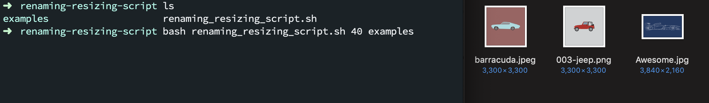
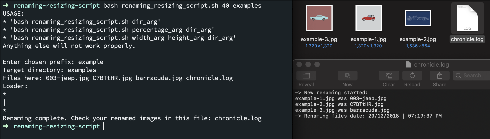

# renaming-resizing-script
### A simple Bash console app.

* Made for the <b>CS324 Scripting Languages</b> course. 🍏
* Used and tested on MacOS. I presume it works fine on Linux. However, this was not checked.
* I liked tinkering with Bash for this.

## Requirements
Needs the ImageMagick package for the <i>convert</i> command. I installed it with [Homebrew](https://brew.sh/):

```
brew install imagemagick
```

For Linux you could try using Linuxbrew or some other alternative to Homebrew.

#### Project results:
<h6>View 1</h6>

<h6>View 2</h6>



